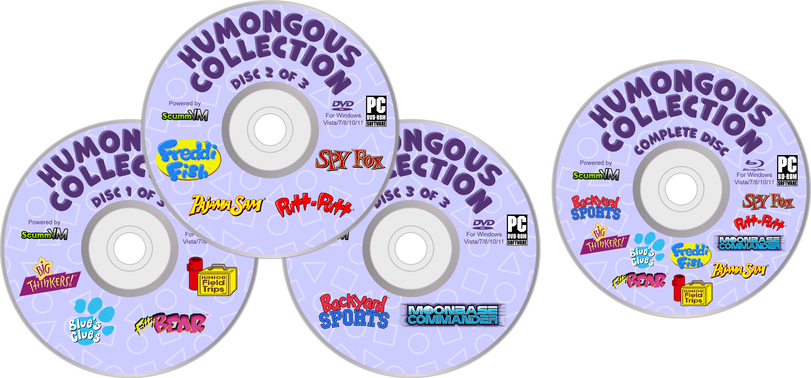
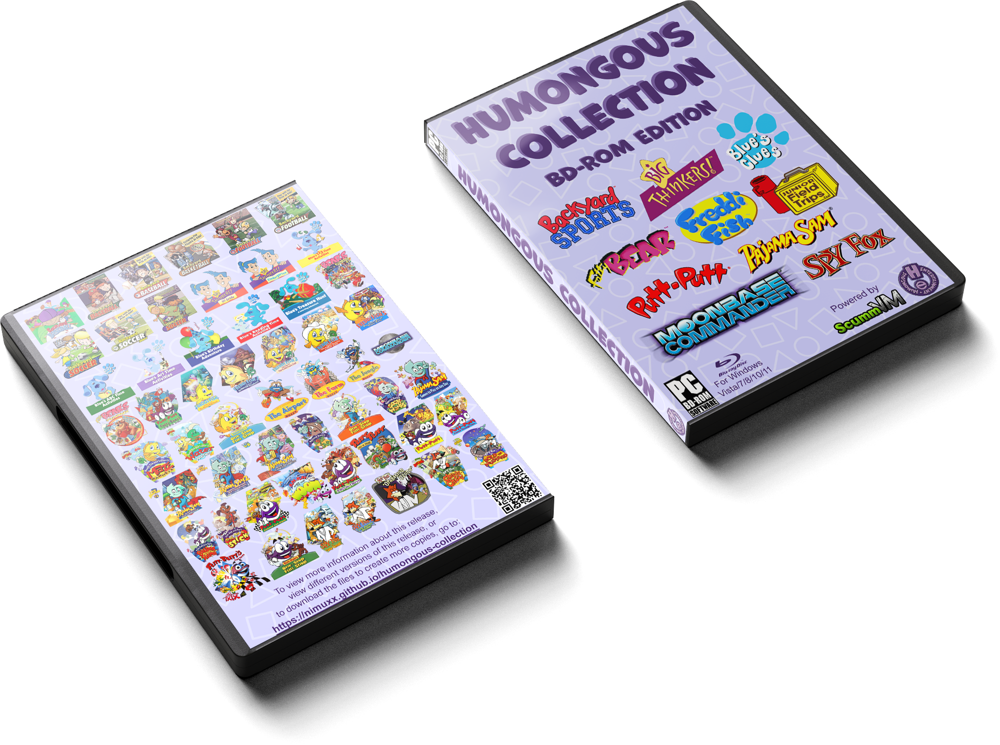
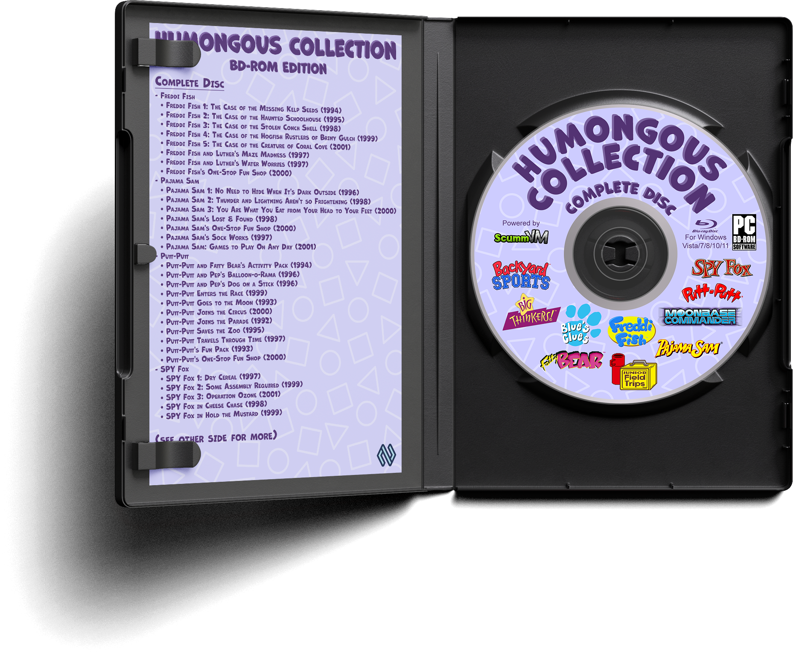

<h1 align="center" style="font-size: 56px !important;">Humongous Collection</h1>
<h2 align="center" style="font-size: 32px !important;">A modern, no-install, disc-based collection of Humongous Entertainment games, powered by ScummVM.</h2>

    <table style="width: 100%; border-collapse: collapse; border: none;">
        <tr style="border: none;">
            <td style="width: 100%; border: none; padding: 0 0 0 0;" colspan=2>
                
            </td>
        </tr>
        <tr style="border: none;">
            <td style="width: 50%; border: none; padding: 0 0 0 0;">
                
            </td>
            <td style="width: 50%; border: none; padding: 20px 0 0 0;">
                
            </td>
        </tr>
    </table>

---

This is a fan-made physical game disc release containing every Humongous Entertainment game that's compatible with ScummVM.

# Features
- It's portable; There is no need to install anything.
    - The game engine, game files, icon database, and configuration file are all loaded from the disc on the fly.
    - Saves, screenshots, and logs are stored on the local hard drive in the default locations for the installed version of ScummVM.
        - Save path: `%APPDATA%\ScummVM\Saved Games`
        - Screenshot path: `%USERPROFILE%\Pictures\ScummVM Screenshots`
        - Log path: `%APPDATA%\ScummVM\Logs\logfile.log`
- It has exceptional modern Windows compatibility.
    - Tested and working on Windows Vista, 7, 8, 10, and 11.
    - Fully supports both 32-bit (x86) and 64-bit (x64) versions of Windows.
    - Contains Autorun functionality with a disc icon and a custom launcher script. This lets you simply right-click your disc drive and run the launcher using the `Install or run program from your media` option.
- Thoughtfully crafted configuration and icon database files have been tailored to make the user experience as easy as possible; A kid should be able to figure it out without instructions. 
- It comes with fully custom physical release art, designed for a keep case (DVD case). This includes disc labels, wrap-around cover art, and an internal insert card.
- There are two (2) versions of the release based on your needs.
    - The first version is split between three single-layer DVDs. DVD drives are more common in PCs, but this version requires a keep case that supports 3 discs via an added middle flap.
    - The second version fits everything on one single-layer Blu-ray. Blu-ray drives aren't as common in PCs, but this version can be stored in a standard 1-disc keep case.

---

# Downloads
- 3 DVD-ROM Set
    - <a href="https://drive.google.com/drive/folders/1CL1tkFbq0vU7fBG9TMU9z9LP7TtWmeK5">[GOOGLE DRIVE]</a>
    - <a href="magnet:?xt=urn:btih:1ae420f5e488ee0a7ac0db0427f28daf399e419f&dn=Humongous%20Collection%20%283%20DVD-ROM%20Set%29&xl=13210636438&tr=udp%3A%2F%2Ftracker.opentrackr.org%3A1337%2Fannounce&tr=udp%3A%2F%2Fopen.demonii.com%3A1337%2Fannounce&tr=udp%3A%2F%2Fopen.stealth.si%3A80%2Fannounce">[MAGNET LINK]</a>
- BD-ROM Edition
    - <a href="https://drive.google.com/drive/folders/1I4RSSHDaRd4DgBy6jJA_bBxS3XNiK9U-">[GOOGLE DRIVE]</a>
    - <a href="magnet:?xt=urn:btih:fba2cbdb5665c36dda9d7fee0f3e048d0ca6742d&dn=Humongous%20Collection%20%28BD-ROM%20Edition%29&xl=12735166811&tr=udp%3A%2F%2Ftracker.opentrackr.org%3A1337%2Fannounce&tr=udp%3A%2F%2Fopen.demonii.com%3A1337%2Fannounce&tr=udp%3A%2F%2Fopen.stealth.si%3A80%2Fannounce">[MAGNET LINK]</a>
- Archival Backup
    - <a href="https://archive.org/details/humongous-collection">[INTERNET ARCHIVE]</a>

---

# How to Make a Physical Release
1. Download either the `3 DVD-ROM Set` or the `BD-ROM Edition` from the links above.
    - You only need the `.iso` and `.png` files to make a physical release. You can skip downloading all the `.md5` and `.par2` files if you aren't concerned about corrupted downloads.
    - Optionally, if you want some way to verify and repair corrupted downloads, then you can download the `.md5` and `.par2` files as well.
        - The `.par2` files only provide 1% redundancy to keep the total package small while still providing a little bit of error tolerance.
        - If you're trying to make an archival backup that can survive heavy data rot, download the `Archival Backup` instead, which has 100% redundancy `.par2` files for HDD backup, in addition to archival `.iso` files with 100% - 200% redundancy built in using [`dvdisaster`](https://github.com/speed47/dvdisaster).
2. Burn the `.iso` file(s) to the disc(s). Use `4x` - `8x` speed for best results.
    - At this point, if you don't care about having pretty labels or box art for the disc(s), you can just label them with a marker and skip the rest of this section.
3. Print out the artwork in the `Print` folders at `300 DPI`. **Do not scale the artwork when printing.** There is an example of what each item should look like after being cut to its final size in the `Preview` folders.
    - The disc label(s) should be printed on pre-cut adhesive CD labels. You will either need to learn how to align the artwork to the CD label paper or pay a local print shop to do it for you.
    - The cover art should be printed on gloss or semi-gloss paper. When cutting it out, try to trim off about `3 mm` of the artwork on every side. The artwork was designed to be cut out this way.
    - The internal insert should be printed on either semi-gloss or matte paper that's thicker than printer paper. Again, it was designed to be cut out by trimming off `3 mm` of printed artwork on each side.
4. Apply the labels to the disc(s), put the front cover and internal insert into the keep case, and you're done!

Congratulations, you have now created a physical game release!

---

# How to Play
1. Insert the disc into your disc drive and wait for it to show up in Windows.
2. Run the launcher script.
    - On older versions of Windows, you will get an Autorun popup prompting you to run the startup script.
    - On newer versions, you will need to right-click the disc drive in Windows Explorer and select `Install or run program from your media`.
    - If all else fails, you can manually run the script by double-clicking on `Run.bat`.
4. Wait for a minute or so while the data is read from the disc.
    - You may see a command window that lingers for a moment, then disappears; this means that the game engine is loading in the background.
    - **Do not run the launcher script more than once, or multiple launcher windows will open.**
5. When the ScummVM launcher finally shows up, double-click the game you wish to play.
    - Wait a moment while the game files are loaded from the disc, then your game will start.
6. You can exit your game at any time, and you will return to the ScummVM launcher.
    - Clicking the exit button a second time on the launcher screen will quit the launcher entirely.
7. When you are done playing, exit the ScummVM launcher completely, then eject the disc.
    - **Ejecting the disc while the ScummVM launcher is still running can result in strange bugs and possible save game corruption.**

---

# Included Games
The DVD-ROM version of this collection has the games split up between 3 DVD discs:

## Disc 1 of 3
- Big Thinkers
    - Big Thinkers 1st Grade *(1997)*
    - Big Thinkers Kindergarten *(1997)*
- Blue's Clues
    - Blue's 123 Time Activities *(1999)*
    - Blue's ABC Time Activities *(1998)*
    - Blue's Clues: Blue's Art Time Activities *(2000)*
    - Blue's Birthday Adventure *(1998)*
    - Blue's Reading Time Activities *(2000)*
    - Blue's Treasure Hunt *(1999)*
- Fatty Bear
    - Fatty Bear's Birthday Surprise *(1993)*
    - Fatty Bear's Fun Pack *(1993)*
    - Putt-Putt and Fatty Bear's Activity Pack *(1994)*
- Junior Field Trips
    - Let's Explore the Airport with Buzzy *(1995)*
    - Let's Explore the Farm with Buzzy *(1994)*
    - Let's Explore the Jungle with Buzzy *(1995)*

## Disc 2 of 3
- Freddi Fish
    - Freddi Fish 1: The Case of the Missing Kelp Seeds *(1994)*
    - Freddi Fish 2: The Case of the Haunted Schoolhouse *(1995)*
    - Freddi Fish 3: The Case of the Stolen Conch Shell *(1998)*
    - Freddi Fish 4: The Case of the Hogfish Rustlers of Briny Gulch *(1999)*
    - Freddi Fish 5: The Case of the Creature of Coral Cove *(2001)*
    - Freddi Fish and Luther's Maze Madness *(1997)*
    - Freddi Fish and Luther's Water Worries *(1997)*
    - Freddi Fish's One-Stop Fun Shop *(2000)*
- Pajama Sam
    - Pajama Sam 1: No Need to Hide When It's Dark Outside *(1996)*
    - Pajama Sam 2: Thunder and Lightning Aren't so Frightening *(1998)*
    - Pajama Sam 3: You Are What You Eat from Your Head to Your Feet *(2000)*
    - Pajama Sam's Lost & Found *(1998)*
    - Pajama Sam's One-Stop Fun Shop *(2000)*
    - Pajama Sam's Sock Works *(1997)*
    - Pajama Sam: Games to Play On Any Day *(2001)*
- Putt-Putt
    - Putt-Putt and Fatty Bear's Activity Pack *(1994)*
    - Putt-Putt and Pep's Balloon-o-Rama *(1996)*
    - Putt-Putt and Pep's Dog on a Stick *(1996)*
    - Putt-Putt Enters the Race *(1999)*
    - Putt-Putt Goes to the Moon *(1993)*
    - Putt-Putt Joins the Circus *(2000)*
    - Putt-Putt Joins the Parade *(1992)*
    - Putt-Putt Saves the Zoo *(1995)*
    - Putt-Putt Travels Through Time *(1997)*
    - Putt-Putt's Fun Pack *(1993)*
    - Putt-Putt's One-Stop Fun Shop *(2000)*
- SPY Fox
    - SPY Fox 1: Dry Cereal *(1997)*
    - SPY Fox 2: Some Assembly Required *(1999)*
    - SPY Fox 3: Operation Ozone *(2001)*
    - SPY Fox in Cheese Chase *(1998)*
    - SPY Fox in Hold the Mustard *(1999)*

## Disc 3 of 3
- Backyard Sports
    - Backyard Baseball *(1997)*
    - Backyard Baseball 2001 *(2000)*
    - Backyard Baseball 2003 *(2002)*
    - Backyard Basketball *(2001)*
    - Backyard Football *(1999)*
    - Backyard Football 2002 *(2001)*
    - Backyard Soccer *(1998)*
    - Backyard Soccer 2004 *(2003)*
    - Backyard Soccer MLS Edition *(2000)*
- Moonbase Commander
    - Moonbase Commander *(2002)*

---

The BD-ROM version contains all the games on a single Blu-ray disc:

## Complete Disc
- Backyard Sports
    - Backyard Baseball *(1997)*
    - Backyard Baseball 2001 *(2000)*
    - Backyard Baseball 2003 *(2002)*
    - Backyard Basketball *(2001)*
    - Backyard Football *(1999)*
    - Backyard Football 2002 *(2001)*
    - Backyard Soccer *(1998)*
    - Backyard Soccer 2004 *(2003)*
    - Backyard Soccer MLS Edition *(2000)*
- Big Thinker
    - Big Thinkers 1st Grade *(1997)*
    - Big Thinkers Kindergarten *(1997)*
- Blue's Clues
    - Blue's 123 Time Activities *(1999)*
    - Blue's ABC Time Activities *(1998)*
    - Blue's Clues: Blue's Art Time Activities *(2000)*
    - Blue's Birthday Adventure *(1998)*
    - Blue's Reading Time Activities *(2000)*
    - Blue's Treasure Hunt *(1999)*
- Fatty Bear
    - Fatty Bear's Birthday Surprise *(1993)*
    - Fatty Bear's Fun Pack *(1993)*
    - Putt-Putt and Fatty Bear's Activity Pack *(1994)*
- Freddi Fish
    - Freddi Fish 1: The Case of the Missing Kelp Seeds *(1994)*
    - Freddi Fish 2: The Case of the Haunted Schoolhouse *(1995)*
    - Freddi Fish 3: The Case of the Stolen Conch Shell *(1998)*
    - Freddi Fish 4: The Case of the Hogfish Rustlers of Briny Gulch *(1999)*
    - Freddi Fish 5: The Case of the Creature of Coral Cove *(2001)*
    - Freddi Fish and Luther's Maze Madness *(1997)*
    - Freddi Fish and Luther's Water Worries *(1997)*
    - Freddi Fish's One-Stop Fun Shop *(2000)*
- Junior Field Trips
    - Let's Explore the Airport with Buzzy *(1995)*
    - Let's Explore the Farm with Buzzy *(1994)*
    - Let's Explore the Jungle with Buzzy *(1995)*
- Moonbase Commander
    - Moonbase Commander *(2002)*
- Pajama Sam
    - Pajama Sam 1: No Need to Hide When It's Dark Outside *(1996)*
    - Pajama Sam 2: Thunder and Lightning Aren't so Frightening *(1998)*
    - Pajama Sam 3: You Are What You Eat from Your Head to Your Feet *(2000)*
    - Pajama Sam's Lost & Found *(1998)*
    - Pajama Sam's One-Stop Fun Shop *(2000)*
    - Pajama Sam's Sock Works *(1997)*
    - Pajama Sam: Games to Play On Any Day *(2001)*
- Putt-Putt
    - Putt-Putt and Pep's Balloon-o-Rama *(1996)*
    - Putt-Putt and Pep's Dog on a Stick *(1996)*
    - Putt-Putt Enters the Race *(1999)*
    - Putt-Putt Goes to the Moon *(1993)*
    - Putt-Putt Joins the Circus *(2000)*
    - Putt-Putt Joins the Parade *(1992)*
    - Putt-Putt Saves the Zoo *(1995)*
    - Putt-Putt Travels Through Time *(1997)*
    - Putt-Putt's Fun Pack *(1993)*
    - Putt-Putt's One-Stop Fun Shop *(2000)*
- SPY Fox
    - SPY Fox 1: Dry Cereal *(1997)*
    - SPY Fox 2: Some Assembly Required *(1999)*
    - SPY Fox 3: Operation Ozone *(2001)*
    - SPY Fox in Cheese Chase *(1998)*
    - SPY Fox in Hold the Mustard *(1999)*
